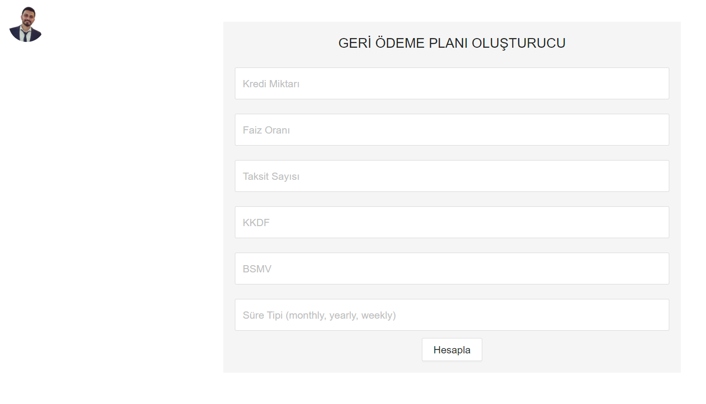
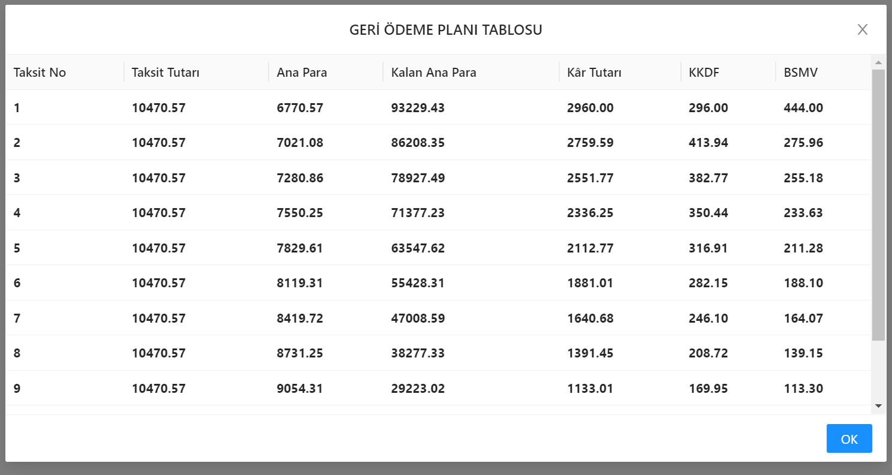

# Repayment Table

## Description

This is a simple program that calculates the repayment table for a loan. It takes the following inputs: 

* Loan amount

* Interest rate

* Number of month, year and week

* Interest rate

* Tax rate

The program then calculates the repayment table and outputs it to pop-up modal.

## This program is using the following libraries and methods:

* OOP (Object Oriented Programming)

* Context API

* React Hooks

* Ant Design

## How to run the program

* Clone the repository

* Run `npm install` to install the dependencies

* Run `npm start` to start the program

* Open [http://localhost:3000](http://localhost:3000) to view it in the browser.

Enjoy!

## Screenshots

## Author

* **Mustafa Polat** - [Github](github.com/polat-mustafa) - [LinkedIn](https://www.linkedin.com/in/polat-mustafa/)

